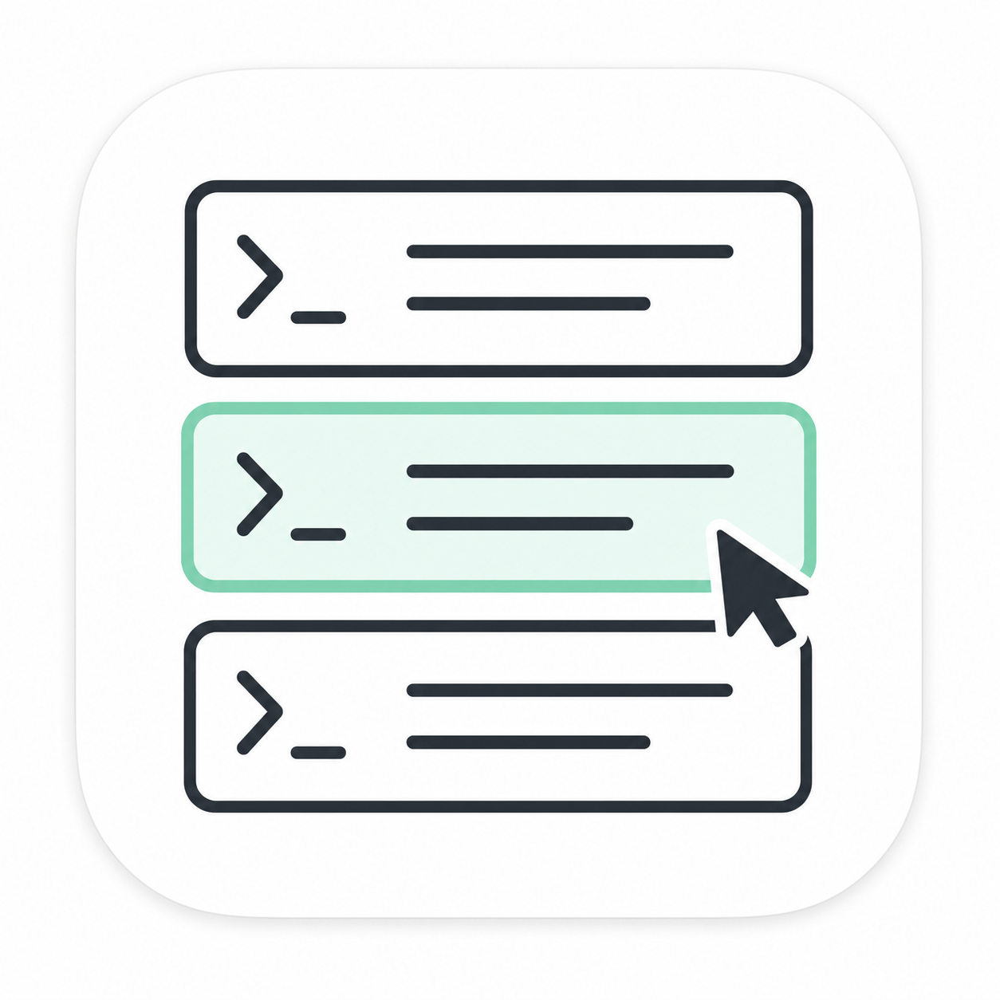
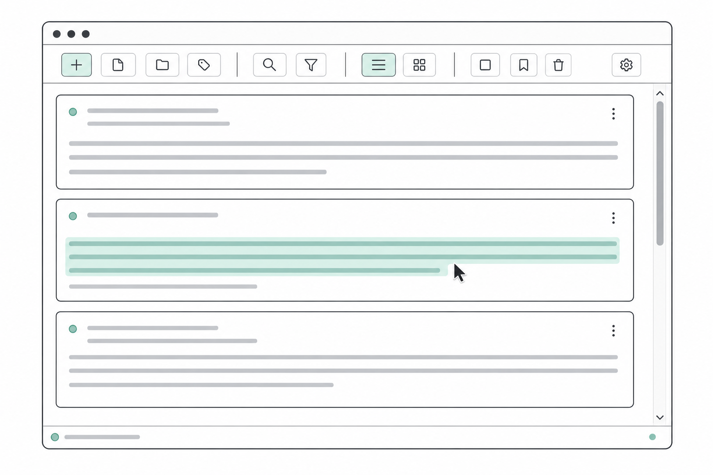

<div align="center">
  

  <h1>babomemo</h1>

  <p><strong>현재 디렉터리에 바로 붙여 쓰는 마우스 중심 터미널 메모장.</strong></p>

  <p>
    <a href="README.md">English</a>
    · <a href="https://github.com/smturtle2/babomemo/releases/latest">다운로드</a>
    · <a href="LICENSE">MIT 라이선스</a>
  </p>
</div>

<p align="center">
  
</p>

`babomemo`는 디렉터리마다 독립된 메모장을 만들어 줍니다. 작업 중인 디렉터리에서 실행하고 필요한 내용을 적으면, 메모는 그 디렉터리의 일반 텍스트 `.babomemo` 파일에 남습니다.

계정, 클라우드 서비스, 별도 워크스페이스는 필요하지 않습니다.

## babomemo를 쓰는 이유

- **디렉터리마다 메모 파일 하나.** 어느 디렉터리에서 실행했는지가 열릴 메모를 결정합니다.
- **필요한 만큼 메모 추가.** 메모가 세로로 이어지며 개수 제한 없이 추가할 수 있습니다.
- **마우스 중심 편집.** 클릭으로 선택하고, 드래그로 텍스트를 고르고, 휠로 메모 목록을 이동합니다.
- **자동 레이아웃.** 메모가 터미널 너비를 채우고, 텍스트를 줄바꿈하며, 내용에 맞춰 높이가 늘어납니다.
- **자동 저장.** 편집을 멈추면 변경 내용이 같은 디렉터리에 자동으로 저장됩니다.
- **터미널 그대로의 화면.** 별도 테마를 적용하지 않고 현재 터미널의 색을 사용합니다.

## 설치

### 미리 빌드된 실행 파일로 설치하기 (권장)

[최신 릴리스](https://github.com/smturtle2/babomemo/releases/latest)를 열고 운영체제에 맞는 압축 파일을 내려받습니다.

| 운영체제 | 아키텍처 | 파일 |
| --- | --- | --- |
| Linux | x86-64 | `babomemo-x86_64-unknown-linux-gnu.tar.gz` |
| Windows | x86-64 | `babomemo-x86_64-pc-windows-msvc.zip` |
| macOS | Apple Silicon | `babomemo-aarch64-apple-darwin.tar.gz` |
| macOS | Intel | `babomemo-x86_64-apple-darwin.tar.gz` |

Linux와 macOS에서는 압축을 푼 뒤 `babomemo`를 `PATH`에 포함된 디렉터리로 옮깁니다. 예를 들면 다음과 같습니다.

```sh
mkdir -p ~/.local/bin
install -m 755 babomemo ~/.local/bin/babomemo
```

`~/.local/bin`이 `PATH`에 포함되어 있는지 확인하세요. Windows에서는 ZIP 파일의 압축을 풀고 `babomemo.exe`를 `PATH`에 포함된 디렉터리로 옮깁니다.

### Cargo로 설치하기

Rust 1.88 이상이 설치되어 있다면 다음 명령을 사용합니다.

```sh
cargo install --git https://github.com/smturtle2/babomemo --locked
```

## 바로 시작하기

메모를 둘 디렉터리로 이동한 뒤 `babomemo`를 실행합니다.

```sh
cd path/to/your-project
babomemo
```

처음 실행하면 그 디렉터리에 `.babomemo`가 만들어집니다. 같은 디렉터리에서 다시 실행하면 해당 파일을 엽니다. 변경 내용은 자동으로 저장되며, <kbd>Ctrl</kbd> + <kbd>D</kbd>를 누르면 남은 변경 내용을 저장한 뒤 종료합니다.

## 조작법

### 마우스

| 동작 | 조작 |
| --- | --- |
| 메모 선택 및 커서 배치 | 메모 안쪽 클릭 |
| 텍스트 선택 | 메모 안쪽 드래그 |
| 메모 목록 이동 | 마우스 휠 |
| 메모 추가 | 목록 끝의 **메모 추가** |
| 메모 삭제 | 메모 테두리의 **삭제** |
| 설정 열기 | 오른쪽 상단의 **설정** |

### 키보드

| 단축키 | 동작 |
| --- | --- |
| <kbd>Ctrl</kbd> + <kbd>N</kbd> | 메모 추가 |
| <kbd>Ctrl</kbd> + <kbd>D</kbd> | 저장 후 종료 |
| <kbd>Enter</kbd> | 삭제 확인 창에서 메모 삭제 확인 |
| <kbd>Esc</kbd> | 설정을 저장하고 설정 창 닫기 |
| <kbd>Ctrl</kbd> + <kbd>A</kbd> | 선택한 메모의 텍스트 전체 선택 |
| <kbd>Ctrl</kbd> + <kbd>C</kbd> / <kbd>X</kbd> / <kbd>V</kbd> | 복사 / 잘라내기 / 붙여넣기 |
| <kbd>Ctrl</kbd> + <kbd>Z</kbd> / <kbd>Y</kbd> | 실행 취소 / 다시 실행 |
| <kbd>Ctrl</kbd> + <kbd>Shift</kbd> + <kbd>Z</kbd> | 다시 실행 |
| <kbd>Shift</kbd> + 방향키 | 텍스트 선택 범위 확장 |
| <kbd>Ctrl</kbd> + 방향키 | 단어 단위 이동 |
| <kbd>Home</kbd> / <kbd>End</kbd> | 화면에 보이는 줄의 처음 / 끝으로 이동 |
| <kbd>Page Up</kbd> / <kbd>Page Down</kbd> | 메모 안에서 페이지 단위 이동 |

babomemo에서 복사한 텍스트에는 원래 메모 내용만 포함됩니다. 테두리, 메모 번호, 버튼, 여백, 화면 줄바꿈은 복사되지 않습니다. <kbd>Shift</kbd> + 드래그 같은 터미널 자체 선택은 babomemo가 아니라 터미널이 처리합니다.

## 저장과 설정

- 메모는 프로그램을 실행한 디렉터리의 `.babomemo`라는 UTF-8 일반 텍스트 파일 하나에 저장됩니다. 어떤 텍스트 편집기로든 열 수 있습니다.
- 저장에 실패하면 오류를 표시하고, 저장되지 않은 내용을 버린 채 종료하지 않습니다.
- 메모 삭제는 실행 전에 확인합니다.
- **설정**에서는 메모의 최소 높이를 변경합니다. 내용이 더 많은 메모는 필요한 만큼 자동으로 높아집니다.
- 메모 너비는 항상 사용 가능한 터미널 너비를 따르며, 터미널 크기가 바뀌면 텍스트를 다시 줄바꿈합니다.
- 색은 터미널 설정을 그대로 사용합니다. 사용할 수 있는 언어가 있으면 운영체제 언어에 맞춰 화면 언어를 선택합니다.

## 라이선스

`babomemo`는 [MIT 라이선스](LICENSE)로 제공됩니다.
